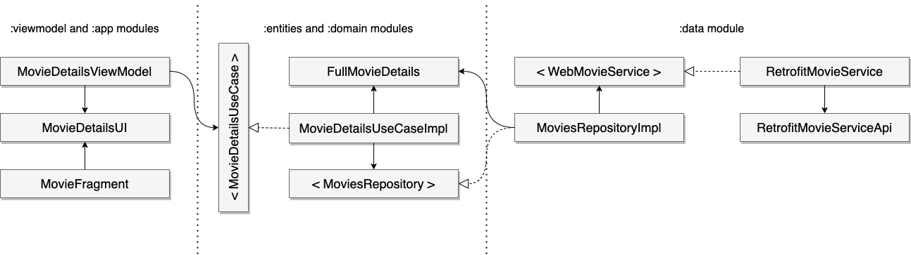

# Cinemin
Cinemin is a free app that shows various information about movies and calculates their budget & revenue in 2021 dollars according to the inflation and purchasing power. This allows you to see the change in budget or box office of a film and compare multiple films made in different years by their real price.

## Demo

## Tech-Stack

* Language: Kotlin
* Architecture: Clean Architecture + MVVM + Single Activity Design
* DI: Koin
* Thread Management:  Coroutines
* Network: Retrofit + OkHttp
* Json Converter: GSON
* Image Caching: Glide
* Data-UI Connection: ViewModel + LiveData
* Analytics: Firebase Analytics + Crashlytics
* Tests: junit, Mockito
* CI: CircleCI

## Architecture
1. Relations between modules:

2. Short example of relations between classes:

## Attribution

1. This product uses the TMDb API but is not endorsed or certified by TMDb. For more information visit <a href="https://https://www.themoviedb.org/">https://www.themoviedb.org</a>

2. Icons made by <a href="https://www.flaticon.com/authors/fjstudio" title="fjstudio">fjstudio</a> from <a href="https://www.flaticon.com/" title="Flaticon">www.flaticon.com</a>

3. Background image from <a href="https://www.pixabay.com/" title="Pixabay">www.pixabay.com</a>